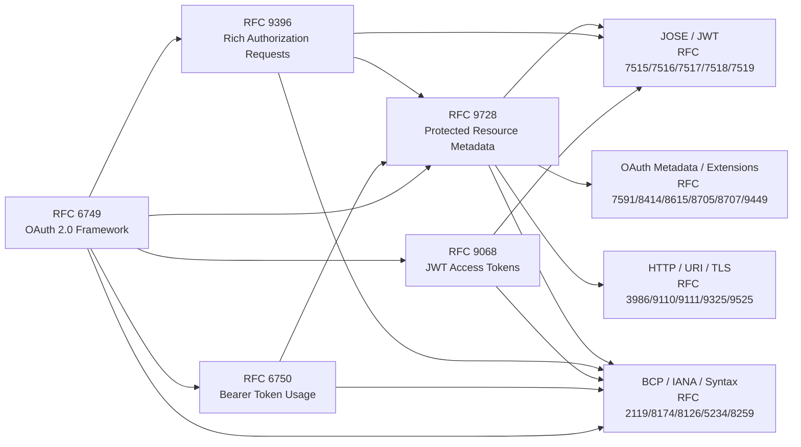

# OAuth 2.0 Specs Mirror for Mercure PR 1262

This directory contains local Markdown mirrors of the OAuth 2.0-related RFCs
needed to review `dunglas/mercure#1262`.

The mirror is intentionally bounded to:

- the OAuth specs directly relevant to the implementation;
- the direct normative RFC dependencies declared by those specs.

## Review Entry Points

| RFC | Spec | Review relevance |
| --- | --- | --- |
| [RFC 6749](rfc6749-the-oauth-2-0-authorization-framework.md) | The OAuth 2.0 Authorization Framework | Base OAuth roles, clients, tokens, grants, endpoints, and error model. |
| [RFC 6750](rfc6750-the-oauth-2-0-authorization-framework-bearer-token-usage.md) | Bearer Token Usage | `Authorization: Bearer`, `WWW-Authenticate`, bearer error codes, token presentation constraints. |
| [RFC 9068](rfc9068-json-web-token-jwt-profile-for-oauth-2-0-access-tokens.md) | JWT Profile for OAuth 2.0 Access Tokens | JWT access-token shape, `typ: at+jwt`, `aud`, issuer and claim expectations. |
| [RFC 9396](rfc9396-oauth-2-0-rich-authorization-requests.md) | Rich Authorization Requests | `authorization_details`, typed authorization data, and fine-grained authorization model. |
| [RFC 9728](rfc9728-oauth-2-0-protected-resource-metadata.md) | Protected Resource Metadata | `.well-known/oauth-protected-resource`, metadata fields, authorization-server discovery. |

## Relationship Map



Read this as “the source RFC depends on or is extended by the target area”,
not as a complete transitive dependency graph.

## Direct Dependency Matrix

These are the direct normative RFC dependencies extracted from the five review
entry points above.

| Seed RFC | Direct normative RFC dependencies included here |
| --- | --- |
| [RFC 6749](rfc6749-the-oauth-2-0-authorization-framework.md) | [RFC 2119](rfc2119-key-words-for-use-in-rfcs-to-indicate-requirement-levels.md), [RFC 2246](rfc2246-the-tls-protocol-version-1-0.md), [RFC 2616](rfc2616-hypertext-transfer-protocol-http-1-1.md), [RFC 2617](rfc2617-http-authentication-basic-and-digest-access-authentication.md), [RFC 2818](rfc2818-http-over-tls.md), [RFC 3629](rfc3629-utf-8-a-transformation-format-of-iso-10646.md), [RFC 3986](rfc3986-uniform-resource-identifier-uri-generic-syntax.md), [RFC 4627](rfc4627-the-application-json-media-type-for-javascript-object-notation-json.md), [RFC 4949](rfc4949-internet-security-glossary-version-2.md), [RFC 5226](rfc5226-guidelines-for-writing-an-iana-considerations-section-in-rfcs.md), [RFC 5234](rfc5234-augmented-bnf-for-syntax-specifications-abnf.md), [RFC 5246](rfc5246-the-transport-layer-security-tls-protocol-version-1-2.md), [RFC 6125](rfc6125-service-identity-in-tls-with-x509-certificates.md) |
| [RFC 6750](rfc6750-the-oauth-2-0-authorization-framework-bearer-token-usage.md) | [RFC 2119](rfc2119-key-words-for-use-in-rfcs-to-indicate-requirement-levels.md), [RFC 2246](rfc2246-the-tls-protocol-version-1-0.md), [RFC 2616](rfc2616-hypertext-transfer-protocol-http-1-1.md), [RFC 2617](rfc2617-http-authentication-basic-and-digest-access-authentication.md), [RFC 2818](rfc2818-http-over-tls.md), [RFC 3986](rfc3986-uniform-resource-identifier-uri-generic-syntax.md), [RFC 5234](rfc5234-augmented-bnf-for-syntax-specifications-abnf.md), [RFC 5246](rfc5246-the-transport-layer-security-tls-protocol-version-1-2.md), [RFC 5280](rfc5280-internet-x-509-public-key-infrastructure-certificate-and-certificate-revocation-list-crl-profile.md), [RFC 6265](rfc6265-http-state-management-mechanism.md), [RFC 6749](rfc6749-the-oauth-2-0-authorization-framework.md) |
| [RFC 9068](rfc9068-json-web-token-jwt-profile-for-oauth-2-0-access-tokens.md) | [RFC 2046](rfc2046-multipurpose-internet-mail-extensions-mime-part-two-media-types.md), [RFC 2119](rfc2119-key-words-for-use-in-rfcs-to-indicate-requirement-levels.md), [RFC 6749](rfc6749-the-oauth-2-0-authorization-framework.md), [RFC 6838](rfc6838-media-type-specifications-and-registration-procedures.md), [RFC 7515](rfc7515-json-web-signature-jws.md), [RFC 7518](rfc7518-json-web-algorithms-jwa.md), [RFC 7519](rfc7519-json-web-token-jwt.md), [RFC 7643](rfc7643-system-for-cross-domain-identity-management-core-schema.md), [RFC 8174](rfc8174-ambiguity-of-uppercase-vs-lowercase-in-rfc-2119-key-words.md), [RFC 8414](rfc8414-oauth-2-0-authorization-server-metadata.md), [RFC 8693](rfc8693-oauth-2-0-token-exchange.md), [RFC 8707](rfc8707-resource-indicators-for-oauth-2-0.md), [RFC 8725](rfc8725-json-web-token-best-current-practices.md) |
| [RFC 9396](rfc9396-oauth-2-0-rich-authorization-requests.md) | [RFC 2119](rfc2119-key-words-for-use-in-rfcs-to-indicate-requirement-levels.md), [RFC 7519](rfc7519-json-web-token-jwt.md), [RFC 7662](rfc7662-oauth-2-0-token-introspection.md), [RFC 8174](rfc8174-ambiguity-of-uppercase-vs-lowercase-in-rfc-2119-key-words.md), [RFC 8414](rfc8414-oauth-2-0-authorization-server-metadata.md), [RFC 8628](rfc8628-oauth-2-0-device-authorization-grant.md), [RFC 8707](rfc8707-resource-indicators-for-oauth-2-0.md) |
| [RFC 9728](rfc9728-oauth-2-0-protected-resource-metadata.md) | [RFC 2119](rfc2119-key-words-for-use-in-rfcs-to-indicate-requirement-levels.md), [RFC 4647](rfc4647-matching-of-language-tags.md), [RFC 5646](rfc5646-tags-for-identifying-languages.md), [RFC 6749](rfc6749-the-oauth-2-0-authorization-framework.md), [RFC 6750](rfc6750-the-oauth-2-0-authorization-framework-bearer-token-usage.md), [RFC 7515](rfc7515-json-web-signature-jws.md), [RFC 7516](rfc7516-json-web-encryption-jwe.md), [RFC 7517](rfc7517-json-web-key-jwk.md), [RFC 7518](rfc7518-json-web-algorithms-jwa.md), [RFC 7519](rfc7519-json-web-token-jwt.md), [RFC 7591](rfc7591-oauth-2-0-dynamic-client-registration-protocol.md), [RFC 8126](rfc8126-guidelines-for-writing-an-iana-considerations-section-in-rfcs.md), [RFC 8174](rfc8174-ambiguity-of-uppercase-vs-lowercase-in-rfc-2119-key-words.md), [RFC 8259](rfc8259-the-javascript-object-notation-json-data-interchange-format.md), [RFC 8414](rfc8414-oauth-2-0-authorization-server-metadata.md), [RFC 8615](rfc8615-well-known-uniform-resource-identifiers-uris.md), [RFC 8705](rfc8705-oauth-2-0-mutual-tls-client-authentication-and-certificate-bound-access-tokens.md), [RFC 8707](rfc8707-resource-indicators-for-oauth-2-0.md), [RFC 8996](rfc8996-deprecating-tls-1-0-and-tls-1-1.md), [RFC 9110](rfc9110-http-semantics.md), [RFC 9111](rfc9111-http-caching.md), [RFC 9325](rfc9325-recommendations-for-secure-use-of-transport-layer-security-tls-and-datagram-transport-layer-security-dtls.md), [RFC 9396](rfc9396-oauth-2-0-rich-authorization-requests.md), [RFC 9449](rfc9449-oauth-2-0-demonstrating-proof-of-possession-dpop.md), [RFC 9525](rfc9525-service-identity-in-tls.md) |

## Relationship Notes for the Mercure Review

- RFC 6749 is the root OAuth framework. RFC 6750, RFC 9068, RFC 9396, and
  RFC 9728 all depend on its terminology.
- RFC 6750 defines the bearer-token HTTP challenge and error vocabulary used
  when Mercure rejects or challenges access tokens.
- RFC 9068 narrows OAuth access tokens to JWTs and is the main source for
  `typ: at+jwt`, `aud`, `iss`, and JWT access-token claim expectations.
- RFC 9396 is the source for `authorization_details`; Mercure's `mercure`
  detail type should be reviewed against this data model.
- RFC 9728 ties the protected resource to discovery metadata and references
  RFC 6750, RFC 9396, JOSE/JWT, HTTP semantics, TLS guidance, and OAuth
  metadata registries.
- RFC 8414 is authorization-server metadata; RFC 9728 mirrors that model for
  protected resources and registers related metadata.
- RFC 8707, Resource Indicators, is relevant when reasoning about resource
  identifiers and token audience/resource binding.
- RFC 8725, JWT Best Current Practices, is a security baseline for JWT handling
  referenced by RFC 9068.

## Thematic Index

### OAuth Core and Extensions

| RFC | Spec | Used directly by |
| --- | --- | --- |
| [RFC 6749](rfc6749-the-oauth-2-0-authorization-framework.md) | The OAuth 2.0 Authorization Framework | RFC 6750, RFC 9068, RFC 9728 |
| [RFC 6750](rfc6750-the-oauth-2-0-authorization-framework-bearer-token-usage.md) | Bearer Token Usage | RFC 9728 |
| [RFC 7591](rfc7591-oauth-2-0-dynamic-client-registration-protocol.md) | Dynamic Client Registration | RFC 9728 |
| [RFC 7662](rfc7662-oauth-2-0-token-introspection.md) | Token Introspection | RFC 9396 |
| [RFC 8414](rfc8414-oauth-2-0-authorization-server-metadata.md) | Authorization Server Metadata | RFC 9068, RFC 9396, RFC 9728 |
| [RFC 8628](rfc8628-oauth-2-0-device-authorization-grant.md) | Device Authorization Grant | RFC 9396 |
| [RFC 8693](rfc8693-oauth-2-0-token-exchange.md) | Token Exchange | RFC 9068 |
| [RFC 8705](rfc8705-oauth-2-0-mutual-tls-client-authentication-and-certificate-bound-access-tokens.md) | Mutual-TLS Client Authentication and Certificate-Bound Access Tokens | RFC 9728 |
| [RFC 8707](rfc8707-resource-indicators-for-oauth-2-0.md) | Resource Indicators | RFC 9068, RFC 9396, RFC 9728 |
| [RFC 9068](rfc9068-json-web-token-jwt-profile-for-oauth-2-0-access-tokens.md) | JWT Profile for OAuth 2.0 Access Tokens | seed spec |
| [RFC 9396](rfc9396-oauth-2-0-rich-authorization-requests.md) | Rich Authorization Requests | RFC 9728 |
| [RFC 9449](rfc9449-oauth-2-0-demonstrating-proof-of-possession-dpop.md) | Demonstrating Proof of Possession (DPoP) | RFC 9728 |
| [RFC 9728](rfc9728-oauth-2-0-protected-resource-metadata.md) | Protected Resource Metadata | seed spec |

### JOSE, JWT, and Token Data

| RFC | Spec | Used directly by |
| --- | --- | --- |
| [RFC 7515](rfc7515-json-web-signature-jws.md) | JSON Web Signature (JWS) | RFC 9068, RFC 9728 |
| [RFC 7516](rfc7516-json-web-encryption-jwe.md) | JSON Web Encryption (JWE) | RFC 9728 |
| [RFC 7517](rfc7517-json-web-key-jwk.md) | JSON Web Key (JWK) | RFC 9728 |
| [RFC 7518](rfc7518-json-web-algorithms-jwa.md) | JSON Web Algorithms (JWA) | RFC 9068, RFC 9728 |
| [RFC 7519](rfc7519-json-web-token-jwt.md) | JSON Web Token (JWT) | RFC 9068, RFC 9396, RFC 9728 |
| [RFC 8725](rfc8725-json-web-token-best-current-practices.md) | JWT Best Current Practices | RFC 9068 |
| [RFC 7643](rfc7643-system-for-cross-domain-identity-management-core-schema.md) | SCIM Core Schema | RFC 9068 |

### HTTP, URI, Cookies, and Web Discovery

| RFC | Spec | Used directly by |
| --- | --- | --- |
| [RFC 2616](rfc2616-hypertext-transfer-protocol-http-1-1.md) | HTTP/1.1 | RFC 6749, RFC 6750 |
| [RFC 2617](rfc2617-http-authentication-basic-and-digest-access-authentication.md) | HTTP Authentication | RFC 6749, RFC 6750 |
| [RFC 2818](rfc2818-http-over-tls.md) | HTTP Over TLS | RFC 6749, RFC 6750 |
| [RFC 3986](rfc3986-uniform-resource-identifier-uri-generic-syntax.md) | URI Generic Syntax | RFC 6749, RFC 6750 |
| [RFC 6265](rfc6265-http-state-management-mechanism.md) | HTTP State Management Mechanism | RFC 6750 |
| [RFC 8615](rfc8615-well-known-uniform-resource-identifiers-uris.md) | Well-Known URIs | RFC 9728 |
| [RFC 9110](rfc9110-http-semantics.md) | HTTP Semantics | RFC 9728 |
| [RFC 9111](rfc9111-http-caching.md) | HTTP Caching | RFC 9728 |

### TLS, Certificates, and Security Guidance

| RFC | Spec | Used directly by |
| --- | --- | --- |
| [RFC 2246](rfc2246-the-tls-protocol-version-1-0.md) | TLS 1.0 | RFC 6749, RFC 6750 |
| [RFC 5246](rfc5246-the-transport-layer-security-tls-protocol-version-1-2.md) | TLS 1.2 | RFC 6749, RFC 6750 |
| [RFC 5280](rfc5280-internet-x-509-public-key-infrastructure-certificate-and-certificate-revocation-list-crl-profile.md) | X.509 PKI Certificate and CRL Profile | RFC 6750 |
| [RFC 6125](rfc6125-service-identity-in-tls-with-x509-certificates.md) | Service Identity with X.509 Certificates | RFC 6749 |
| [RFC 8996](rfc8996-deprecating-tls-1-0-and-tls-1-1.md) | Deprecating TLS 1.0 and TLS 1.1 | RFC 9728 |
| [RFC 9325](rfc9325-recommendations-for-secure-use-of-transport-layer-security-tls-and-datagram-transport-layer-security-dtls.md) | Secure Use of TLS and DTLS | RFC 9728 |
| [RFC 9525](rfc9525-service-identity-in-tls.md) | Service Identity in TLS | RFC 9728 |
| [RFC 4949](rfc4949-internet-security-glossary-version-2.md) | Internet Security Glossary | RFC 6749 |

### Syntax, Registries, Media Types, and Language Tags

| RFC | Spec | Used directly by |
| --- | --- | --- |
| [RFC 2046](rfc2046-multipurpose-internet-mail-extensions-mime-part-two-media-types.md) | MIME Part Two: Media Types | RFC 9068 |
| [RFC 2119](rfc2119-key-words-for-use-in-rfcs-to-indicate-requirement-levels.md) | Requirement Keywords | all five seed specs |
| [RFC 3629](rfc3629-utf-8-a-transformation-format-of-iso-10646.md) | UTF-8 | RFC 6749 |
| [RFC 4627](rfc4627-the-application-json-media-type-for-javascript-object-notation-json.md) | `application/json` / JSON | RFC 6749 |
| [RFC 4647](rfc4647-matching-of-language-tags.md) | Matching of Language Tags | RFC 9728 |
| [RFC 5226](rfc5226-guidelines-for-writing-an-iana-considerations-section-in-rfcs.md) | IANA Considerations Guidelines | RFC 6749 |
| [RFC 5234](rfc5234-augmented-bnf-for-syntax-specifications-abnf.md) | ABNF | RFC 6749, RFC 6750 |
| [RFC 5646](rfc5646-tags-for-identifying-languages.md) | Language Tags | RFC 9728 |
| [RFC 6838](rfc6838-media-type-specifications-and-registration-procedures.md) | Media Type Registration Procedures | RFC 9068 |
| [RFC 8126](rfc8126-guidelines-for-writing-an-iana-considerations-section-in-rfcs.md) | IANA Considerations Guidelines | RFC 9728 |
| [RFC 8174](rfc8174-ambiguity-of-uppercase-vs-lowercase-in-rfc-2119-key-words.md) | RFC 2119 Keyword Clarification | RFC 9068, RFC 9396, RFC 9728 |
| [RFC 8259](rfc8259-the-javascript-object-notation-json-data-interchange-format.md) | JSON Data Interchange Format | RFC 9728 |

## Export Provenance

Each file is a Markdown export of the RFC Editor text source:

`https://www.rfc-editor.org/rfc/rfcXXXX.txt`

The mirror can be regenerated with:

```sh
./mirror-rfcs.py --clean
```

By default, the script writes to this directory. Use `--output-dir <path>` to
build the mirror elsewhere. Use `--keep-export-dirs` to inspect mdzilla's
intermediate `rfcXXXX/` directories before they are removed.

For a single RFC, the underlying export command is:

```sh
pnpx mdzilla https://www.rfc-editor.org/rfc/rfcXXXX.txt --export oauth2-specs/rfcXXXX
```

After export, files were moved from `rfcXXXX/index.md` to the flat
`rfcXXXX-lowercase-spec-title.md` filenames used in this directory.

`mdzilla` was first tried against the RFC Editor and Datatracker HTML pages for
RFC 6749, but those exports included site chrome or rendered HTML. The `.txt`
RFC source produced the usable Markdown mirror kept here.
